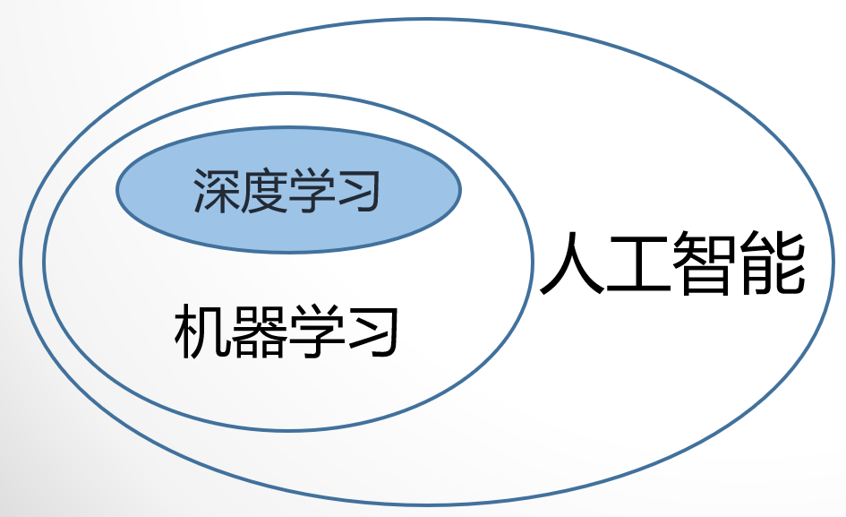
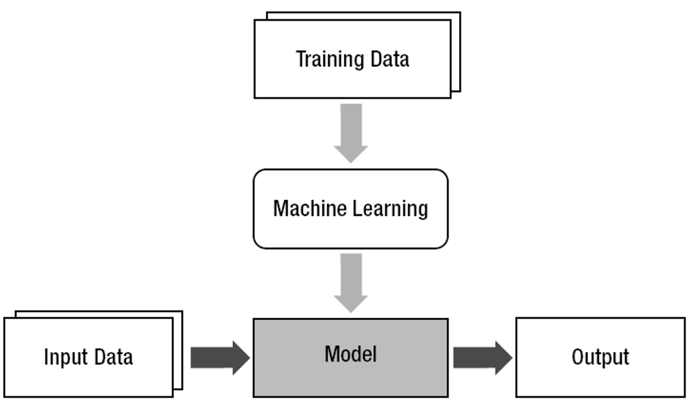
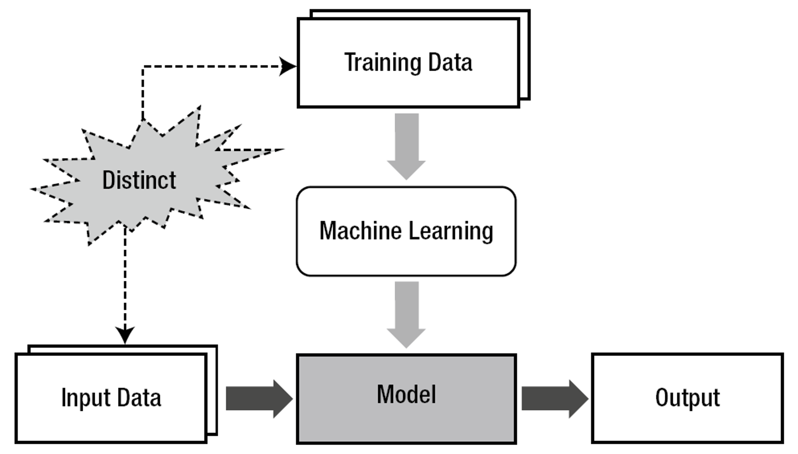

# 第一章 绪论
- 概念&关系：深度学习 | 机器学习 | 人工智能
- 机器学习：基本框架&面临的挑战
- 机器学习问题的分类

[TOC]
## 一、概念
**人工智能**：指由人制造出来的机器所表现出来的智能。通常人工智能是指通过普通计算机程序来呈现人类智能的技术。    
**机器学习**：人工智能的分支。机器学习算法是一类从数据中自动分析获得规律，并利用规律对未知数据进行预测的算法。一种从“数据”获得“模型”的技术。    
**深度学习**：一种机器学习技术。是一种以人工神经网络为架构，对数据进行表征学习的算法。    
**人工智能、机器学习、深度学习的关系**：

**机器学习的基本框架**：

## 二、机器学习面临的挑战

训练数据与实际数据的差异导致问题变得复杂。    
**泛化**：使模型能一致（不依赖特定训练数据或输入数据）。    
**过拟合**：泛化失败的主要原因。    
**产生过拟合的原因**：    
- 训练数据：含有噪声 & 不全面（缺乏代表性）    
- 间接原因：待训练的模型自由度过多。    

**如何应对过拟合**：
- 训练数据：尽量准确 & 全面（大数据）    
- 模型自由度、任务复杂度、训练数据三者相匹配（加约束）    
- 学习（训练）过程：适可而止！    

**如何让学习算法适可而止：**    
- 低维数据：可视化    
- 高维数据：引入检验环节    

## 三、机器学习问题的类别
### （一）根据训练方法（训练数据类型）
- 监督学习{输入，输出}    
- 非监督学习{输入}&nbsp;&nbsp;&nbsp;&nbsp;聚类问题    
- 强化学习{输入，部分输出，部分输出的评价}&nbsp;&nbsp;&nbsp;&nbsp;棋牌、自主导航    
### （二）根据求解问题的类型监督学习又分为
- 分类（Classification）：垃圾邮件识别、数字识别、人脸识别    
- 回归（Regression）：预测未来气温、视觉定位、股票估值    