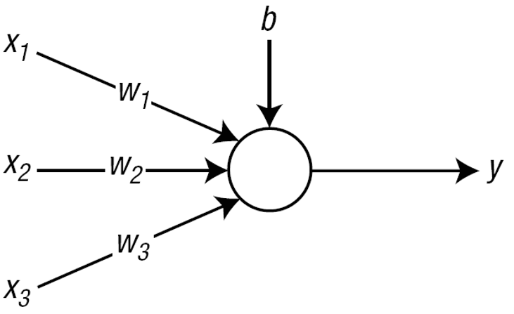
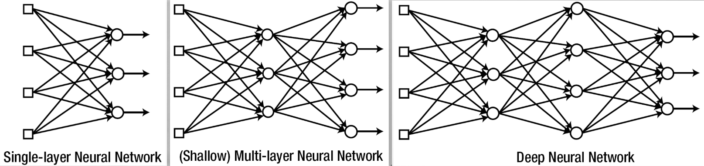
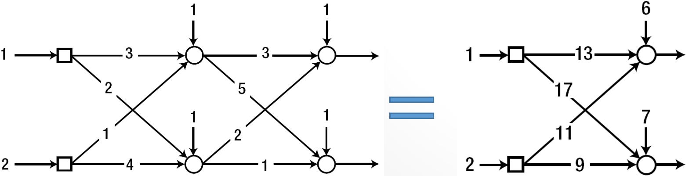
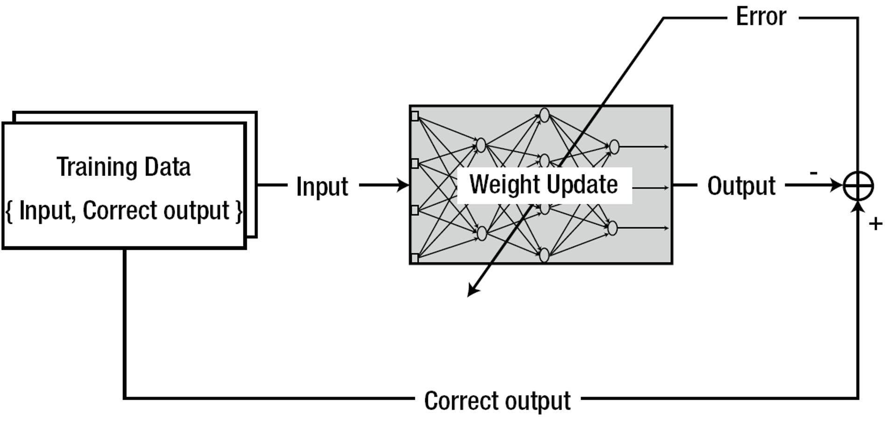
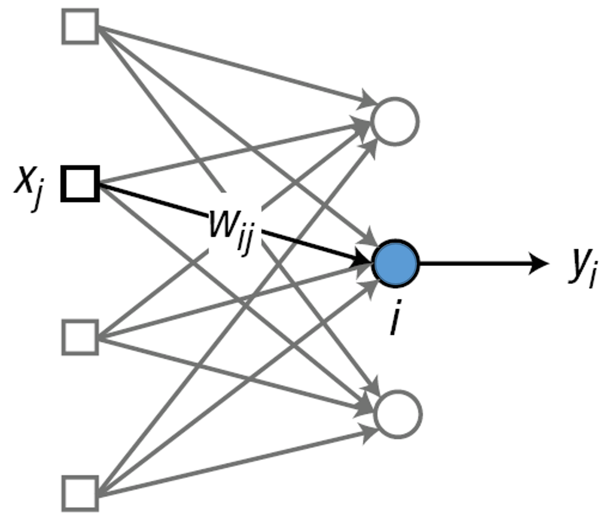
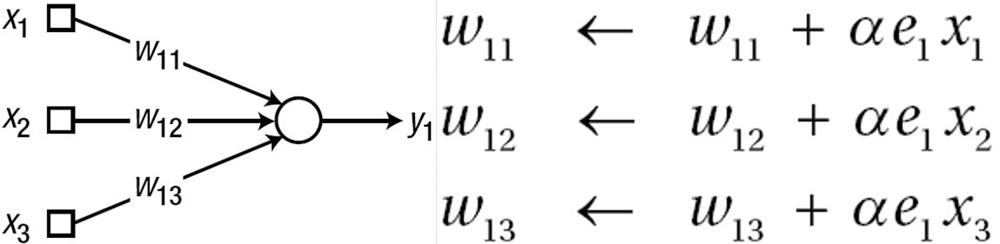
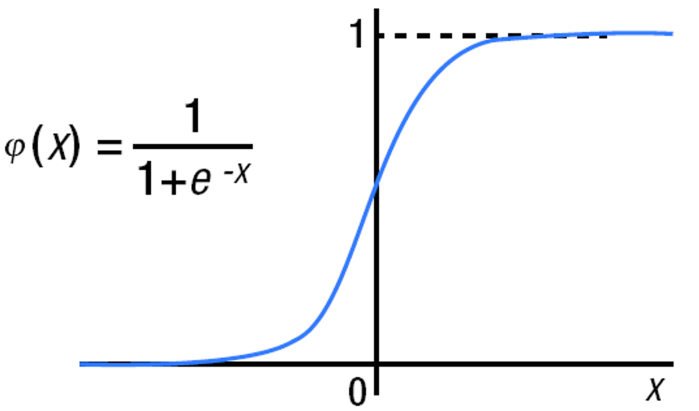

# 第二章 神经网络概述

[TOC]
## 一、基本概念
**神经网络（Neural Network，简称NN）**：一种能基于机器学习的（可被训练的）计算模型。    
神经网络模拟人脑机理：    
| Brain | Neural Netwoek|
|------ | ----- |
| Neuron | Node |
| Connection of Neurons | Connection Weight |
神经网络以权值系数的形式存储信息。    
### （一）神经元——神经网络的结点
    
节点的计算方式：    
$$v = (w_1 \times x_1) + (w_2 \times x_2) + (w_3 \times x_3) + b$$    
令$w = [w_1 \quad w_2 \quad w_3], x = \left[ \begin{array}{c}
    x_1\\
    x_2\\
    x_3
\end{array} \right]$：    
$$v = wx + b$$    
最终的得到节点的输出为：$y = \phi(v) = \phi(wx + b)$。$\phi(•)$：激活函数，决定最终节点行为（输出）。    
### （二）神经网络的分层
神经网络层数的变迁：    

神经网络分层的含义：    

单层神经网络和多层神经网络的比较：    
<table text-align="left" border="1">
<caption></caption>
    <tr>
        <td colspan="2">Single-Layer Neural Network</td>
        <td>Input Layer - Output Layer</td>
    </tr>
    <tr>
        <td rowspan="2">Multi-Layer Neural Network</td>
        <td>Shallow Neural Network</td>
        <td>Input Layer - Hidden Layer - Output Layer</td>
    </tr>
    <tr>
        <td>Deep Neural Network</td>
        <td>Input Layer - Hidden Layers - Output Layer</td>
    </tr>
</table>

若隐层采用线性激活函数则隐层无效：    
如下图，激活函数为$y = \phi(v) = v$，可以看到，隐层相当于无效（无论多少层，每层多少个节点），输出层可采用线性函数。    
    
单隐层NN可拟合任意函数！（通过增加隐层节点数）    
### （三）神经网络的监督学习
**基本步骤**：
1. 初始化权值系数（用合适的值）；    
2. 提取一个训练样本：{输入, 正确的输出}，将其输入NN；比较并计算NN输出与正确输出之间的误差。    
3. 调整权值系数，以减少上述误差。    
4. 重复2、3直到遍历所有样本。    

监督学习的基本步骤：    

## 二、单层训练
神经网络以权值系数（含偏差）的形式存储信息，用新信息训练神经网络，则需相应的修改权值系数，根据给定的信息修改权值的系统方法称为学习规则，训练是神经网络系统化存储信息的唯一方式。    
**学习规则**：Delta规则（单层NN的代表性学习规则）、扩展Delta规则、Adaline规则、Widrow-Hoff规则等。    
### （一）Delta规则

$y_i$：节点i的当前实际输出；    
$d_i$：节点i的正确（期望）输出；    
$$e_i \triangleq d_i - y_i$$
**权值调整原则**：    
- 输出误差$e_i$大，则相应权值调整量大；
- 输入值$X_j$大，则相应权值调整量大（输入节点对输出误差贡献大）；

调整量正比于相应的输入和误差，即：    
$$w_{ij} \leftarrow w_{ij} + \alpha e_i x_j$$
其中$\alpha$为学习率，并且$0 < \alpha \leq 1$。     
下图是一个权值调整的例子：    

### （二）训练算法的具体步骤
1. 初始化权值系数（用合适的值）。    
2. 提取某训练样本{输入, 正确的输出}带入NN；计算节点输出与正确输出之间的误差：$e_i = d_i - y_i$。    
3. 依据Delta规则计算权值更新量：$\Delta w_{ij} = \alpha e_i x_j$。    
4. 调整权值：$w_{ij} \leftarrow w_{ij} + \Delta w{ij}$。    
5. 重复步骤2-4直到遍历所有训练数据。
6. 重复步骤2-5直到误差可接受（预设阈值）。    

步骤2-5称为一个**Epoch（轮）**。    
**为什么要用同一个样本训练集重复训练**：Delta规则是一种梯度下降算法，需迭代求解，无法一步到位。    

### （三）一般化的Delta规则
最初的形式：$w_{ij} \leftarrow w_{ij} + \alpha e_i x_j$    
Delta规则的更一般形式：    
$$w_{ij} \leftarrow w_{ij} + \alpha \delta_i x_j$$
其中，$\delta_i = \phi' (v_i) e_i$，$v_i$为第i个节点的加权和，$\phi'(•)$为第i个输出节点激活函数的导数。对于线性激活函数$y = \phi (v) = v$得：$\phi' (v) = 1$。    
**一般形式得Delta规则举例**：
Sigmoid激活函数：    

它的导数为：$\phi' = \phi (x)(1 - \phi (x))$。    
根据一般化的Delta规则得：$w_{ij} \leftarrow w_{ij} + \alpha \phi(v_i)(1 - \phi(v_i)) e_i x_j$。    
**权值得更新量不仅与误差、输入有关，还与激活函数有关**。    
### （四）常用的权值更新算法

更新算法：随机梯度下降（SGD）、批量、小批量    
训练实例：基于Matlab的算法实现 & 性能比较    
## 三、单层局限性
线性可分VS线性不可分   
